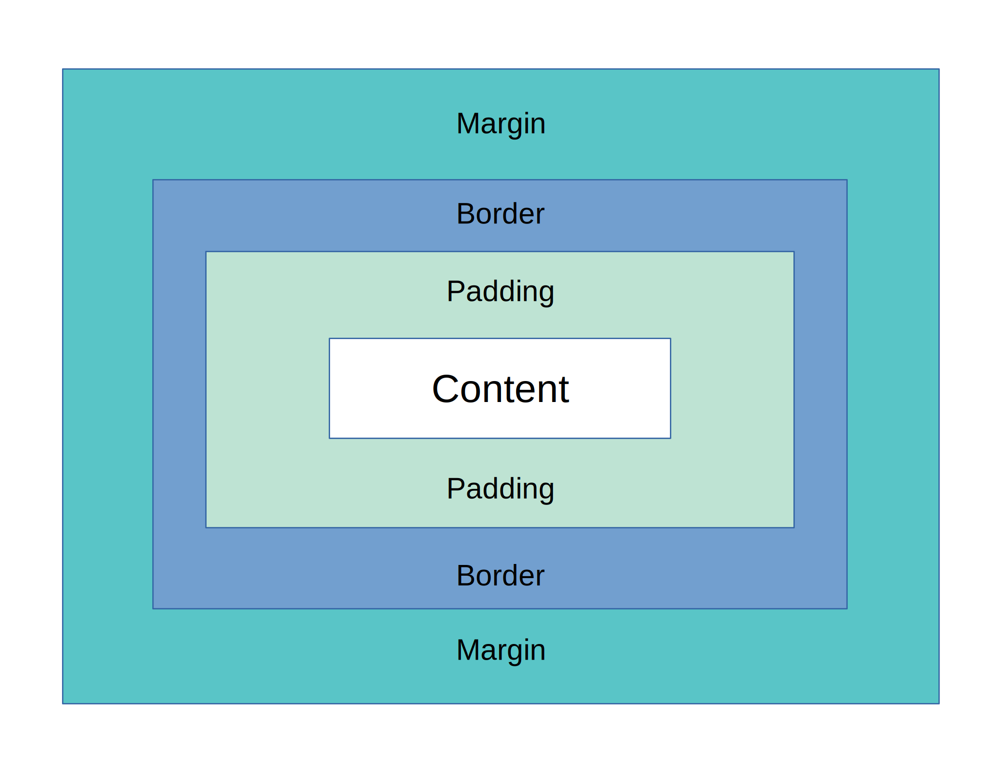

# Box Model

Todos os elementos visuais possuem um Box Model. Dito isso, temos:

1. Content: conteúdo da Tag HTML
2. Padding: espaçamento interno da Tag HTML
3. Border: bordas da Tag HTML
4. Margin: espaçamento em relação aos outros elementos HTML